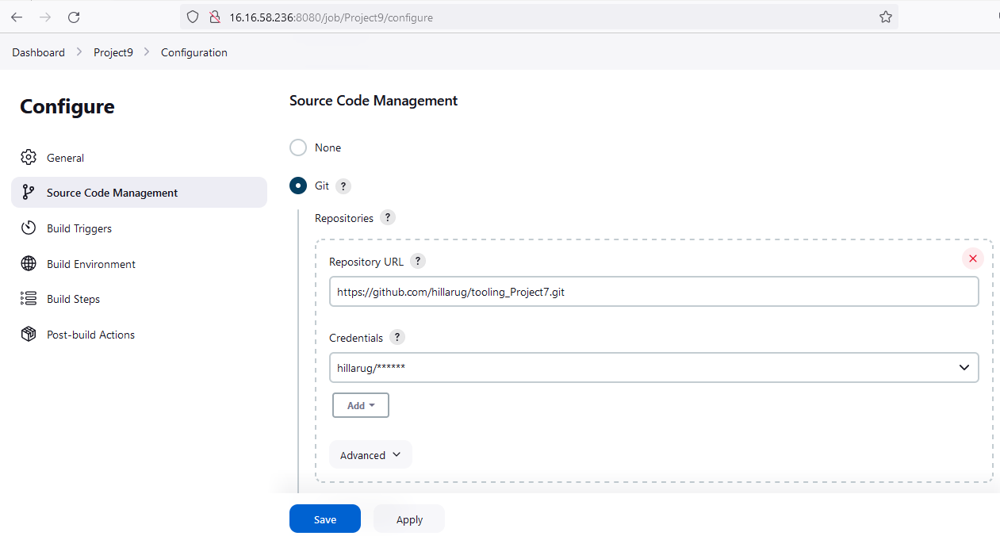

Projects

    Projects

Docs

    (STEP 19) PROJECT 9: Continous Integration Pipeline For Tooling Website

    TOOLING WEBSITE DEPLOYMENT AUTOMATION WITH CONTINUOUS INTEGRATION USING JENKINS.

Tooling Website deployment automation with Continuous Integration. Introduction to Jenkins

In previous Project 8 we introduced horizontal scalability concept, which allow us to add new Web Servers to our Tooling Website and you have successfully deployed a set up with 2 Web Servers and also a Load Balancer to distribute traffic between them. If it is just two or three servers – it is not a big deal to configure them manually. Imagine that you would need to repeat the same task over and over again adding dozens or even hundreds of servers.

DevOps is about Agility, and speedy release of software and web solutions. One of the ways to guarantee fast and repeatable deployments is Automation of routine tasks.

In this project we are going to start automating part of our routine tasks with a free and open source automation server – Jenkins. It is one of the most popular CI/CD tools, it was created by a former Sun Microsystems developer Kohsuke Kawaguchi and the project originally had a named “Hudson”.

According to Circle CI, Continuous integration (CI) is a software development strategy that increases the speed of development while ensuring the quality of the code that teams deploy. Developers continually commit code in small increments (at least daily, or even several times a day), which is then automatically built and tested before it is merged with the shared repository.

In our project we are going to utilize Jenkins CI capabilities to make sure that every change made to the source code in GitHub https://github.com/<yourname>/tooling will be automatically be updated to the Tooling Website.
Side Self Study

Read about Continuous Integration, Continuous Delivery and Continuous Deployment.
Task

Enhance the architecture prepared in Project 8 by adding a Jenkins server, configure a job to automatically deploy source codes changes from Git to NFS server.

Here is how your updated architecture will look like upon competition of this project

Install and Configure Jenkins server
Step 1 – Install Jenkins server
1. Create an AWS EC2 server based on Ubuntu Server 20.04 LTS and name it “Jenkins”
2. Install JDK (since Jenkins is a Java-based application)

sudo apt update
sudo apt install default-jdk-headless
3. Install Jenkins
curl -fsSL https://pkg.jenkins.io/debian-stable/jenkins.io-2023.key | sudo tee \
  /usr/share/keyrings/jenkins-keyring.asc > /dev/null
echo deb [signed-by=/usr/share/keyrings/jenkins-keyring.asc] \
  https://pkg.jenkins.io/debian-stable binary/ | sudo tee \
  /etc/apt/sources.list.d/jenkins.list > /dev/null
sudo apt-get update
sudo apt-get install jenkins

sudo systemctl status jenkins

By default Jenkins server uses TCP port 8080 – open it by creating a new Inbound Rule in your EC2 Security Group

 
4. Perform initial Jenkins setup.

From your browser access http://<Jenkins-Server-Public-IP-Address-or-Public-DNS-Name>:8080

You will be prompted to provide a default admin password

13.53.124.55:8080

ubuntu@ip-172-31-27-69:~$ sudo cat /var/lib/jenkins/secrets/initialAdminPassword
7125e8a3cf0d45f88574m4d52babcff9e

So, this is the Jenkins dashboard.

Step 2 – Configure Jenkins to retrieve source codes from GitHub using Webhooks

In this part, you will learn how to configure a simple Jenkins job/project (these two terms can be used interchangeably). This job will will be triggered by GitHub webhooks and will execute a ‘build’ task to retrieve codes from GitHub and store it locally on Jenkins server.
1. Enable webhooks in your GitHub repository settings

Save the configuration and let us try to run the build. For now, we can only do it manually. Click the "Build Now" button, if you have configured everything correctly, the build will be successful and you will see it under #1.

You can open the build and check in "Console Output" if it has run successfully. If so – congratulations! You have just made your very first Jenkins build! But this build does not produce anything and it runs only when we trigger it manually. Let us fix it.

Click "Configure" your job/project and add these two configurations. Configure triggering the job from the GitHub

Configure "Post-build Actions" to archive all the files – files resulting from a build are called "artifacts".

Now, go ahead and make some changes in any file in your GitHub repository (e.g. README.MD file) and push the changes to the master branch. You will see that a new build has been launched automatically (by webhook) and you can see its results – artifacts, saved on the Jenkins server.

You have now configured an automated Jenkins job that receives files from GitHub by webhook trigger (this method is considered as ‘push’ because the changes are being ‘pushed’ and file transfer is initiated by GitHub). There are also other methods: trigger one job (downstream) from another (upstream), poll GitHub periodically and others. By default, the artifacts are stored on the Jenkins server locally.
ls /var/lib/jenkins/jobs/tooling_github/builds/<build_number>/archive/

Step 3 – Configure Jenkins to copy files to NFS server via SSH.
Now we have our artifacts saved locally on Jenkins server, the next step is to copy them to our NFS server to /mnt/apps directory. Jenkins is a highly extendable application and there are 1400+ plugins available. We will need a plugin that is called "Publish Over SSH".

Install the "Publish Over SSH" plugin. On the main dashboard select "Manage Jenkins" and choose the "Manage Plugins" menu item. On the "Available" tab search for the "Publish Over SSH" plugin and install it

Configure the job/project to copy artifacts over to the NFS server. On the main dashboard select "Manage Jenkins" and choose the "Configure System" menu item. Scroll down to Publish over the SSH plugin configuration section and configure it to be able to connect to your NFS server:
Provide a private key (the content of .pem file that you use to connect to the NFS server via SSH/Putty)
Arbitrary name
Hostname – can be private IP address of your NFS server
Username – ec2-user (since the NFS server is based on EC2 with RHEL 8)
Remote directory – /mnt/apps since our Web Servers use it as a mounting point to retrieve files from the NFS server Test the configuration and make sure the connection returns Success. Remember, that TCP port 22 on NFS server must be open to receive SSH connections.

Save the configuration, open your Jenkins job/project configuration page and add another one "Post-build Action"

Save this configuration and go ahead, and change something in README.MD file in your GitHub Tooling repository. Webhook will trigger a new job and in the "Console Output" of the job you will find something like this:

Finished: SUCCESS

To make sure that the files in /mnt/apps have been updated – connect via SSH/Putty to your NFS server and check README.MD file cat /mnt/apps/README.md. I used the grep command to filter the exact text with which I updated the README.md file.

[ec2-user@ip-172-31-40-74 ~]$ ls /mnt/apps
apache-config.conf  cgi-bin  Dockerfile  html  Jenkinsfile  mnt  README.md  start-apache  test.md  tooling-db.sql

